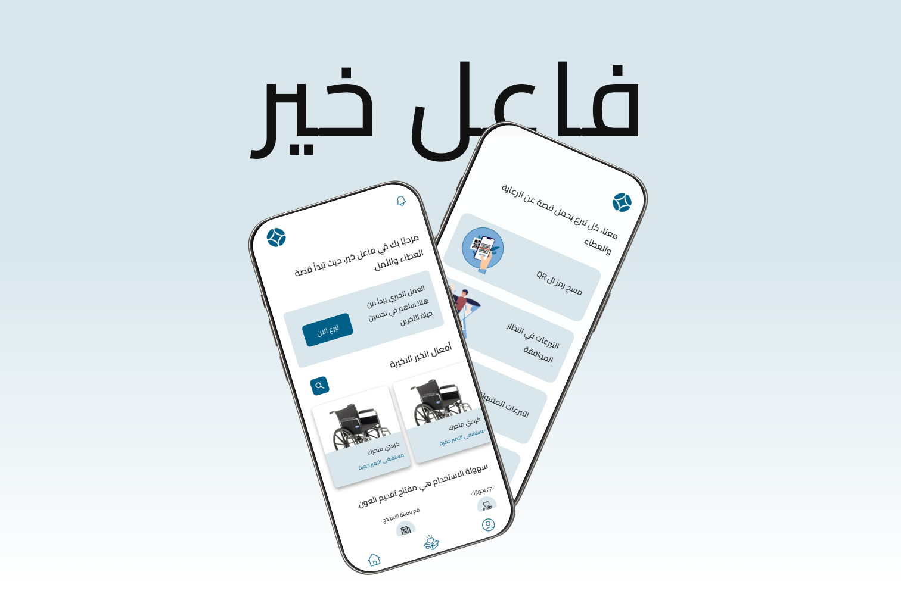

# Faeil Khayr User Application


# Description

Hello and welcome to Faeil Khayr Repo, where you will be introduced to to an innovative application capable of making a significant impact in the field of healthcare. We'll be reviewing the User App, which makes it easy to donate devices to local hospitals and search for and order devices from hospitals using the app. This application is part of the Faeil Khayr project

## Tools Used

 **React Native:** The mobile app is built using React Native.

 **Expo Router:** For navigation within the app, we've utilized Expo's built-in navigation components, making it easy to create a smooth and intuitive user experience.

## 🚀 Check out the app!

### Prerequisites

Before you begin, ensure you have met the following requirements:

**Node.js:** Make sure you have Node.js installed on your machine. You can download it from [nodejs.org](https://nodejs.org/).

**Expo CLI:** If you haven't already, install the Expo CLI globally:

  ```bash
  npm install -g expo-cli
```

### Installing the app on your machine

```bash
git clone https://github.com/ja03/CR-HospitalApp
```

```bash
cd hospital-app-2.0
```

```bash
npm install
```

### Start the app

```bash
npx expo start
```

